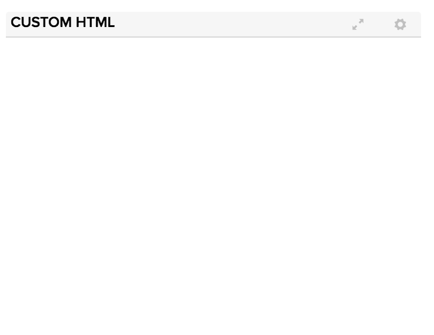

# Committed vs Delivered v2

## Summary/Description

## Updates
This is an updated version of Committed vs Delivered.  This app has several differences from the original app, including:
* It currently only supports Iteration timeboxes and Story artifacts.  The ability to use Portfolio Items and Releases has not been tested so that functionality has been disabled.  
* It allows for caching of historical data in a hidden Iteration custom field.  The custom field must be a text field and must be hidden for the app to store historical cache data there.  
* This app looks only at historical data, so if a story is moved into an out of a sprint, it will show as planned/unplanned.  There is a setting called "minDuration" that allows for excluding stories that have been added and removed and only existed in an iteration for a short amount of time (minDuration). 
* This app does not allow for filtering of data
* Exports are allowed when running the app at all levels.  However, detailed data about each item can only be exported if the app is running at the team level or above.  Details are not available for export at higher project levels.   

## Inclusion of Data

*  If a story is committed to a sprint and the story is accepted within the same sprint before the end date, it will be considered "Delivered" for that sprint.  
*  If that same story is moved out of the sprint into another sprint it will be marked as planned/unplanned to that sprint when it is moved into the sprint.  If it is in the Accepted within the sprint, then it will also count as delivered for that sprint.  
**Example Scenario**:  Customer has a "CV Defect" bucket story that they add defects to within a sprint.  That may be accepted by the end of the sprint, but then it is moved into new sprint and more defects are added to it, changing it's accepted state.  

*  Anything added/removed within the planning window to timebox end is counted unless it is removed within the minDuration amount of time

*  If an item has been deleted, then it will not show up in the original app, but it will in this app 

*  If the item was accepted and deleted before the sprint ends, it will not be shown as delivered.  If it was accepted and deleted after the sprint end, it will be shown as delivered.

* If there are more than 300 items in a timebox in a project, then the cache will not save an will always need to be recalculated 

### Work Items Accepted BEFORE the Timebox Start Date 
*  If **Exclude Items accepted before start date** App setting is selected, then items accepted BEFORE the start date of the Timebox will NOT be counted towards the planned/unplanned OR delivered count.  If **Exclude Items Accepted before start date** is unchecked than these items will be included in both counts.  

### Work Items Accepted after the Timebox End Date 
*  Work Items accepted after the timebox end date will NOT count towards the delivered count.  
*  Work Items accepted after the timebox end date WILL count towards the planned/unplanned count, depending on when they were added to the Sprint.  

### Min Duration in Hours
If a min duration in Hours is set, then any items that exist within the timebox for less than the specified duration of time will not be counted towards planned/unplanned data nor will they count towards delivered data.  If the min duration applies to the beginning or end of the timebox/planning window, then the items will also be excluded.  

For example, if **minDuration** is set to 3 hours and an item is added to the timebox 2.5 hours before the timebox ends, it will not be included in the count.  

### Export
Export of the data that went into the calculations is available at all levels.  This data includes:
* ObjectID
* FormattedID
* Added to Timebox on or Before Date
* Removed from the Timebox on or After Date 
* Delivered Date (also the same as Accepted Date)
* Snapshot Count for Timebox (number of snapshots found for the timebox window)
* Timebox Name
* Project
* Timebox Start Date
* Timebox End DAte
* Is Delivered in Timebox
* Is Planned (based on current app settings for planning window)
* Is Included in Dataset (based on current app settings for excluding/including items based on AcceptedDate and duration in timebox)
* Planning Date Cutoff (based on app settings for planning window)

If the level that the app is being run at is a leaf project (e.g. Team level ) or the Parent of a team level project, then the option will be available to choose fields for exporting additional detail.  This option is not available at higher levels due to performance concerns.   

## Development Notes

The original committed v delivered looks at items in the iteration between the planning window and end of the iteration.  It then uses the oids from those items to load current items and get the accepted date.  Thus, items that have been deleted are not accounted for.  

In both versions items will be counted for each iteration they are associated with in the planned window.  

### First Load

If you've just downloaded this from github and you want to do development,
you're going to need to have these installed:

 * node.js
 * grunt-cli
 * grunt-init

Since you're getting this from github, we assume you have the command line
version of git also installed.  If not, go get git.

If you have those three installed, just type this in the root directory here
to get set up to develop:

  npm install

#### Deployment & Tests

If you want to use the automatic deployment mechanism, be sure to use the
**makeauth** task with grunt to create a local file that is used to connect
to Rally.  This resulting auth.json file should NOT be checked in.

### Structure

  * src/javascript:  All the JS files saved here will be compiled into the
  target html file
  * src/style: All of the stylesheets saved here will be compiled into the
  target html file
  * test/fast: Fast jasmine tests go here.  There should also be a helper
  file that is loaded first for creating mocks and doing other shortcuts
  (fastHelper.js) **Tests should be in a file named <something>-spec.js**
  * test/slow: Slow jasmine tests go here.  There should also be a helper
  file that is loaded first for creating mocks and doing other shortcuts
  (slowHelper.js) **Tests should be in a file named <something>-spec.js**
  * templates: This is where templates that are used to create the production
  and debug html files live.  The advantage of using these templates is that
  you can configure the behavior of the html around the JS.
  * config.json: This file contains the configuration settings necessary to
  create the debug and production html files.  
  * package.json: This file lists the dependencies for grunt
  * auth.json: This file should NOT be checked in.  This file is needed for deploying
  and testing.  You can use the makeauth task to create this or build it by hand in this'
  format:
    {
        "username":"you@company.com",
        "password":"secret",
        "server": "https://rally1.rallydev.com"
    }

### Usage of the grunt file
#### Tasks

##### grunt debug

Use grunt debug to create the debug html file.  You only need to run this when you have added new files to
the src directories.

##### grunt build

Use grunt build to create the production html file.  We still have to copy the html file to a panel to test.

##### grunt test-fast

Use grunt test-fast to run the Jasmine tests in the fast directory.  Typically, the tests in the fast
directory are more pure unit tests and do not need to connect to Rally.

##### grunt test-slow

Use grunt test-slow to run the Jasmine tests in the slow directory.  Typically, the tests in the slow
directory are more like integration tests in that they require connecting to Rally and interacting with
data.

##### grunt deploy

Use grunt deploy to build the deploy file and then install it into a new page/app in Rally.  It will create the page on the Home tab and then add a custom html app to the page.  The page will be named using the "name" key in the config.json file (with an asterisk prepended).

You can use the makeauth task to create this file OR construct it by hand.  Caution: the
makeauth task will delete this file.

The auth.json file must contain the following keys:
{
    "username": "fred@fred.com",
    "password": "fredfredfred",
    "server": "https://us1.rallydev.com"
}

(Use your username and password, of course.)  NOTE: not sure why yet, but this task does not work against the demo environments.  Also, .gitignore is configured so that this file does not get committed.  Do not commit this file with a password in it!

When the first install is complete, the script will add the ObjectIDs of the page and panel to the auth.json file, so that it looks like this:

{
    "username": "fred@fred.com",
    "password": "fredfredfred",
    "server": "https://us1.rallydev.com",
    "pageOid": "52339218186",
    "panelOid": 52339218188
}

On subsequent installs, the script will write to this same page/app. Remove the
pageOid and panelOid lines to install in a new place.  CAUTION:  Currently, error checking is not enabled, so it will fail silently.

##### grunt watch

Run this to watch files (js and css).  When a file is saved, the task will automatically build, run fast tests, and deploy as shown in the deploy section above.

##### grunt makeauth

This task will create an auth.json file in the proper format for you.  **Be careful** this will delete any existing auth.json file.  See **grunt deploy** to see the contents and use of this file.

##### grunt --help  

Get a full listing of available targets.
